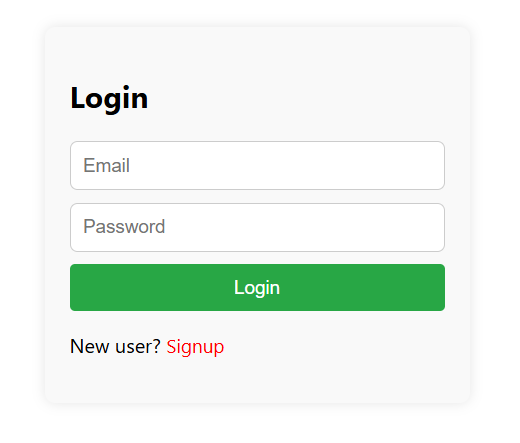
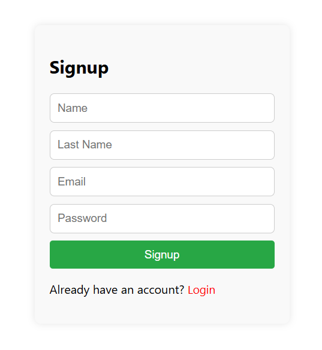

<div align="center">

# 🔐 Signup & Login Authentication System

### A Secure Full Stack Authentication System built with the MERN Stack


</div>

---

# 📌 Project Overview

This is a complete Full Stack Authentication System developed using the **MERN Stack**.

The application allows users to securely register, log in, and access protected pages using **JWT Authentication**. It follows a clean architecture with separate frontend and backend applications.

---

# ✨ Features

✅ User Registration

✅ User Login

✅ JWT Authentication

✅ Protected Routes

✅ Password bcrypt

✅ MongoDB Database

✅ REST API

✅ Responsive UI

✅ Form Validation

---

# 🛠 Tech Stack

## Frontend

- React.js
- JavaScript (ES6)
- HTML5
- CSS3
- Bootstrap

## Backend

- Node.js
- Express.js

## Database

- MongoDB

## Tools

- Git
- GitHub
- VS Code
- Postman

---

# 📂 Project Structure

```text
Signup-and-Login-Page
│
├── React.js
│   ├── public
│   ├── src
│   │
│   ├── Components
│   ├── App.js
│   └── index.js
│
├── Node.js
│   ├── bin
│   ├── controller
│   ├── module
│   ├── public
│   ├── routes
│   ├── views
│   ├── app.js
│   └── package.json
│
└── README.md
```

---

# 🚀 Installation

## Clone Repository

```bash
git clone https://github.com/JDsarvaiya/Signup-and-Login-Page.git
```

---

## Install Frontend

```bash
cd React.js

npm install

npm start
```

---

## Install Backend

```bash
cd Node.js

npm install

npm start
```

---

# 🔑 Environment Variables

Create a **.env** file inside **Node.js**

```env
PORT=3000

MONGO_URI=YOUR_MONGODB_CONNECTION_STRING

JWT_SECRET=YOUR_SECRET_KEY
```

---

# 📸 Application Screenshots

## 🏠 Login Page

<p align="center">

</p>

---

## 📝 Signup Page

<p align="center">

</p>

---

# 🔮 Future Improvements

- Forgot Password

- Email Verification

- Google Login

- User Profile

- Dark Mode

- Role Based Authentication

---

# 🤝 Contributing

Contributions are welcome!

Feel free to fork the repository and submit a pull request.

---

# 👨‍💻 Author

## Jaydeep Sarvaiya

📧 Email

jdsarvaiya1712@gmail.com

🔗 LinkedIn

https://linkedin.com/in/jaydeep-sarvaiya-781708189

💻 GitHub

https://github.com/JDsarvaiya

---

# ⭐ Show Your Support

If you found this project helpful,

please consider giving it a ⭐ on GitHub.

It motivates me to build more amazing projects.

---

<div align="center">

Made with ❤️ by **Jaydeep Sarvaiya**

</div>
